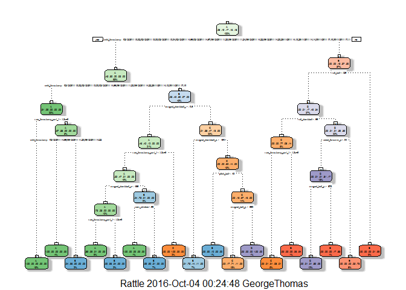

Background
----------

Using devices such as Jawbone Up, Nike FuelBand, and Fitbit it is now
possible to collect a large amount of data about personal activity
relatively inexpensively. These type of devices are part of the
quantified self movement - a group of enthusiasts who take measurements
about themselves regularly to improve their health, to find patterns in
their behavior, or because they are tech geeks. One thing that people
regularly do is quantify how much of a particular activity they do, but
they rarely quantify how well they do it. In this project, we use data
from accelerometers on the belt, forearm, arm, and dumbell of 6
participants and make predictions about the manner in which they did the
exercise.

More information is available from the website here:
<http://groupware.les.inf.puc-rio.br/har> (see the section on the Weight
Lifting Exercise Dataset).

Get libraries

    library(caret)

    ## Loading required package: lattice

    ## Loading required package: ggplot2

    library(rpart)
    library(compare)

    ## 
    ## Attaching package: 'compare'

    ## The following object is masked from 'package:base':
    ## 
    ##     isTRUE

    library(RColorBrewer)
    library(compareDF)
    library(rattle)

    ## Rattle: A free graphical interface for data mining with R.
    ## Version 4.1.0 Copyright (c) 2006-2015 Togaware Pty Ltd.
    ## Type 'rattle()' to shake, rattle, and roll your data.

    library(randomForest)

    ## randomForest 4.6-12

    ## Type rfNews() to see new features/changes/bug fixes.

    ## 
    ## Attaching package: 'randomForest'

    ## The following object is masked from 'package:ggplot2':
    ## 
    ##     margin

    library(knitr)

Data Process
------------

The important part is to identify the different types of NA in the train
dataset and to perform the right cleanup. In our case \#DIV/0! proved to
be the challenging part.First we load the data

    trainUrl <-"https://d396qusza40orc.cloudfront.net/predmachlearn/pml-training.csv"
    testUrl <- "https://d396qusza40orc.cloudfront.net/predmachlearn/pml-testing.csv"
    #train = read.csv(file=trainUrl)
     train = read.csv(file=trainUrl,header = TRUE,na.strings = c("NA","NaN","","#DIV/0!"))
    test = read.csv(file=testUrl)
    dim(test)

    ## [1]  20 160

    dim(train)

    ## [1] 19622   160

we see that we have a training set of 19622 obs. of 160 variables and a
testing set of 20 obs. of 160 variables. Next we perform some
preprocess.

Cleaning Data
-------------

We will get rid of NA data , setting a boundary of 50% NA's per variable
: if more than 50% of a variable's data is NA we will simply reject this
variable from our further study.We are writing a function that will
allow us to choose how many NA's the row can have before it is deleted:
keep only data wiht no NA's

    #clean_train<-train[complete.cases(train),]
    #clean columns with only NA's
    clean_train<-train[colSums(!is.na(train))>0]
    clean_test<-test[colSums(!is.na(test))>0]
    clean_train <- clean_train[ lapply( clean_train, function(x) sum(is.na(x)) / length(x) ) < 0.5 ]
    clean_train<-clean_train[c(-1)]  #we remove X since it offer nothing to the study and causes problem to the analysis... 
    clean_test<-clean_test[c(-1)]  #we remove X since it offer nothing to the study and causes problem to the analysis... 

(Note that we have remove first column since it offers no real
statistical value)

we split the data 60-40, having 60% training data and 40% validation
data.

    set.seed(12345) # For reproducibile purpose
    inTrain <- createDataPartition(clean_train$classe, p=0.60, list=FALSE)
    trainData <- clean_train[inTrain, ]
    testData <- clean_train[-inTrain, ]

DATA MODELS
-----------

We create our data model using the random forest algorithm and the
classification algorithm.

Classification algorithms
-------------------------

First we use the rpart function and the method class(classification
trees) to train and predict our test data.

    Rpart_Fit <- rpart(classe ~ ., data=trainData, method="class")
    fancyRpartPlot(Rpart_Fit)

We now make prediction on our -split test data:

    predictions1 <- predict(Rpart_Fit, testData, type = "class")
    conf_rpart <- confusionMatrix(predictions1, testData$classe)
    conf_rpart

    ## Confusion Matrix and Statistics
    ## 
    ##           Reference
    ## Prediction    A    B    C    D    E
    ##          A 2150   60    7    1    0
    ##          B   61 1260   69   64    0
    ##          C   21  188 1269  143    4
    ##          D    0   10   14  857   78
    ##          E    0    0    9  221 1360
    ## 
    ## Overall Statistics
    ##                                           
    ##                Accuracy : 0.8789          
    ##                  95% CI : (0.8715, 0.8861)
    ##     No Information Rate : 0.2845          
    ##     P-Value [Acc > NIR] : < 2.2e-16       
    ##                                           
    ##                   Kappa : 0.8468          
    ##  Mcnemar's Test P-Value : NA              
    ## 
    ## Statistics by Class:
    ## 
    ##                      Class: A Class: B Class: C Class: D Class: E
    ## Sensitivity            0.9633   0.8300   0.9276   0.6664   0.9431
    ## Specificity            0.9879   0.9693   0.9450   0.9845   0.9641
    ## Pos Pred Value         0.9693   0.8666   0.7809   0.8936   0.8553
    ## Neg Pred Value         0.9854   0.9596   0.9841   0.9377   0.9869
    ## Prevalence             0.2845   0.1935   0.1744   0.1639   0.1838
    ## Detection Rate         0.2740   0.1606   0.1617   0.1092   0.1733
    ## Detection Prevalence   0.2827   0.1853   0.2071   0.1222   0.2027
    ## Balanced Accuracy      0.9756   0.8997   0.9363   0.8254   0.9536

Accuracy : 0.8789 Next we use them to actually predict on the test data

    prediction_Rpart_fit <- predict(Rpart_Fit, clean_test, type = "class")
    prediction_Rpart_fit

    ##  1  2  3  4  5  6  7  8  9 10 11 12 13 14 15 16 17 18 19 20 
    ##  B  A  C  A  A  E  D  C  A  A  B  C  B  A  E  E  A  B  B  B 
    ## Levels: A B C D E

Random Forest
-------------

Next we build a random forest algrorithm and repeat the process of
train/prediction. The problem of very long computation time is resolved
by tuning the control parameter (check
<http://stackoverflow.com/questions/24857772/caret-train-rf-model-inexplicably-long-execution>
for more details)

    control <- trainControl(method = "cv", number = 5,allowParallel=TRUE)
    RandomForest_Fit<-train(classe ~.,data=trainData,method="rf",trControl =control)
    print(RandomForest_Fit)

    ## Random Forest 
    ## 
    ## 11776 samples
    ##    58 predictor
    ##     5 classes: 'A', 'B', 'C', 'D', 'E' 
    ## 
    ## No pre-processing
    ## Resampling: Cross-Validated (5 fold) 
    ## Summary of sample sizes: 9420, 9421, 9421, 9421, 9421 
    ## Resampling results across tuning parameters:
    ## 
    ##   mtry  Accuracy   Kappa    
    ##    2    0.9862436  0.9825960
    ##   41    0.9986415  0.9982817
    ##   80    0.9983017  0.9978520
    ## 
    ## Accuracy was used to select the optimal model using  the largest value.
    ## The final value used for the model was mtry = 41.

    predictions2 <- predict(RandomForest_Fit, trainData)
    conf_rf <- confusionMatrix(trainData$classe , predictions2)
    conf_rf

    ## Confusion Matrix and Statistics
    ## 
    ##           Reference
    ## Prediction    A    B    C    D    E
    ##          A 3348    0    0    0    0
    ##          B    0 2279    0    0    0
    ##          C    0    0 2054    0    0
    ##          D    0    0    0 1930    0
    ##          E    0    0    0    0 2165
    ## 
    ## Overall Statistics
    ##                                      
    ##                Accuracy : 1          
    ##                  95% CI : (0.9997, 1)
    ##     No Information Rate : 0.2843     
    ##     P-Value [Acc > NIR] : < 2.2e-16  
    ##                                      
    ##                   Kappa : 1          
    ##  Mcnemar's Test P-Value : NA         
    ## 
    ## Statistics by Class:
    ## 
    ##                      Class: A Class: B Class: C Class: D Class: E
    ## Sensitivity            1.0000   1.0000   1.0000   1.0000   1.0000
    ## Specificity            1.0000   1.0000   1.0000   1.0000   1.0000
    ## Pos Pred Value         1.0000   1.0000   1.0000   1.0000   1.0000
    ## Neg Pred Value         1.0000   1.0000   1.0000   1.0000   1.0000
    ## Prevalence             0.2843   0.1935   0.1744   0.1639   0.1838
    ## Detection Rate         0.2843   0.1935   0.1744   0.1639   0.1838
    ## Detection Prevalence   0.2843   0.1935   0.1744   0.1639   0.1838
    ## Balanced Accuracy      1.0000   1.0000   1.0000   1.0000   1.0000

The accuracy is really impressing for the validation set: Accuracy :
0.9994 . Next we move to our testing set:

    print(RandomForest_Fit$finalModel)

    ## 
    ## Call:
    ##  randomForest(x = x, y = y, mtry = param$mtry) 
    ##                Type of random forest: classification
    ##                      Number of trees: 500
    ## No. of variables tried at each split: 41
    ## 
    ##         OOB estimate of  error rate: 0.09%
    ## Confusion matrix:
    ##      A    B    C    D    E  class.error
    ## A 3348    0    0    0    0 0.0000000000
    ## B    0 2279    0    0    0 0.0000000000
    ## C    0    3 2049    2    0 0.0024342746
    ## D    0    0    2 1926    2 0.0020725389
    ## E    0    0    0    2 2163 0.0009237875

    prediction_RandomForest_Fit <- predict(RandomForest_Fit, clean_test)
    prediction_RandomForest_Fit

    ##  [1] B A B A A E D B A A B C B A E E A B B B
    ## Levels: A B C D E

Thank you for your time.
