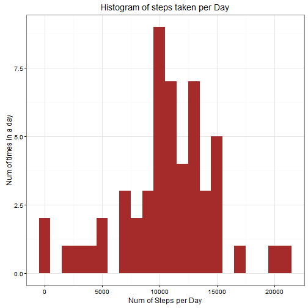

## Introduction

This document is part of the first assignment for reproducible research and it shows some of the feautures of Markdown & knitr in RStudio. First of all we will begin by loading all libraries necessary for the analysis.


```r
library(data.table)
```

```
## data.table 1.9.6  For help type ?data.table or https://github.com/Rdatatable/data.table/wiki
```

```
## The fastest way to learn (by data.table authors): https://www.datacamp.com/courses/data-analysis-the-data-table-way
```

```r
library(ggplot2)
```

## Loading and preprocessing the data
We assume the zip file is downloaded in your current directory.


```r
#setwd("C:/Users/GeorgeThomas/Documents/coursera/datascience/reproducible-research/course-project-1")
unzip(zipfile="repdata-data-activity.zip")
data <- read.csv("activity.csv",header=TRUE,sep=",")
```

## Perform some prepprocessing of data
Minor processing of data = we choose to convert the date field with as.Date comand

```r
data$date<-as.Date(data$date)
```
## What is mean total number of steps taken per day?
For this part of the assignment, you can ignore the missing values in the dataset.

Calculate the total number of steps taken per day

```r
total.steps <- aggregate(steps ~ date, data, sum)
head(total.steps)
```

```
##         date steps
## 1 2012-10-02   126
## 2 2012-10-03 11352
## 3 2012-10-04 12116
## 4 2012-10-05 13294
## 5 2012-10-06 15420
## 6 2012-10-07 11015
```

And here is the histogram:



## What is the average daily activity pattern?

This question is very easy to answer but it is a good opportunity to show the possibility of integrating variable displaying within text.First let's evaluate meanStep,and medianStep:

```r
meanStep   <- mean(total.steps$steps, na.rm=TRUE)
medianStep <- median(total.steps$steps, na.rm=TRUE)
```
Now,let's display what we have found within our text like this:
The number of mean steps is 1.0766189 &times; 10<sup>4</sup> and the number of median steps is 10765.


## Time series plot of the average number of steps taken

## The 5-minute interval that, on average, contains the maximum number of steps

```r
averages[which.max(averages$steps),]
```

```
##     interval    steps
## 104      835 206.1698
```

,so 835 interval has a maximum of 206 steps.


## Code to describe and show a strategy for imputing missing data

Calculate and report the total number of missing values in the dataset (i.e. the total number of rows with NAs)
To answer the question above we do:

```r
missing_vals <- sum(is.na(data$steps))
```
so, the number of missing values is 2304

NOTE:Devise a strategy for filling in all of the missing values in the dataset. The strategy does not need to be sophisticated. For example, you could use the mean/median for that day, or the mean for that 5-minute interval, etc.

We are going to use the final proposed strategy ,namely the "5-minute interval" to fill in the missing values.
First we are going to construct a function and then we are going to use it to build our filled version of the data.


```r
fill.missing.value <- function(steps, interval) {
# Flush all -initial conditions.
      filled <- NA
    if (!is.na(steps))
        filled <- c(steps)
    else
        filled <- (averages[averages$interval==interval, "steps"])
    return(filled)
}
data.complete <- data
data.complete$steps <- mapply(fill.missing.value, data.complete$steps, data.complete$interval)
```
Let's do a cross-check and see if indeed we have filled all missing data ,by calculating the missing data(there shouldn't be any!).

```r
sum(is.na(data.complete$steps))
```

```
## [1] 0
```
## Histogram of the total number of steps taken each day after missing values are imputed

Do these values differ from the estimates from the first part of the assignment?
Answer: Yes ,as it can be seen from visual comparison between the two histograms 
But let's make some additional research by simply computing basic parameters already calculated above,such as median/mean values:


```r
meanStepComplete   <- mean(total.steps.complete$steps, na.rm=TRUE)
medianStepComplete <- median(total.steps.complete$steps, na.rm=TRUE)
```
We see that,mean Steps are the same and equal to :1.0766189 &times; 10<sup>4</sup>,but median steps slightly differ:10765 and after fill: 1.0766189 &times; 10<sup>4</sup>.

## Panel plot comparing the average number of steps taken per 5-minute interval across weekdays and weekends
Are there differences in activity patterns between weekdays and weekends?

As suggested we will create a new factor variable in the dataset with two levels - "weekday" and "weekend" indicating whether a given date is a weekday or weekend day. 


```r
weekdays.or.weekends <- function(date) {
    day <- weekdays(date)
    if (day %in% c("Monday", "Tuesday", "Wednesday", "Thursday", "Friday"))
        return("weekday")
    else if (day %in% c("Saturday", "Sunday"))
        return("weekend")
}
data.complete$date <- as.Date(data.complete$date)
data.complete$day <- sapply(data.complete$date, FUN=weekdays.or.weekends)
```
So,do a dual plotting here:

```r
averages <- aggregate(steps ~ interval + day, data=data.complete, mean)
ggplot(averages, aes(interval, steps)) + geom_line() + facet_grid(day ~ .) +
    xlab("5-minute interval") + ylab("Number of steps")
```


## Thank you very much for your time :-) 
